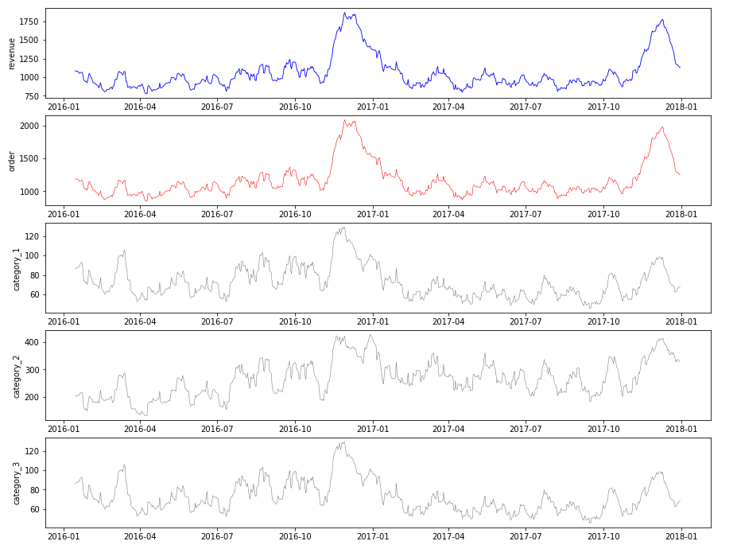
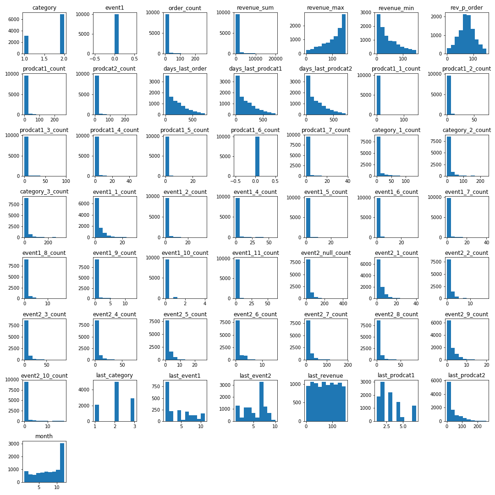
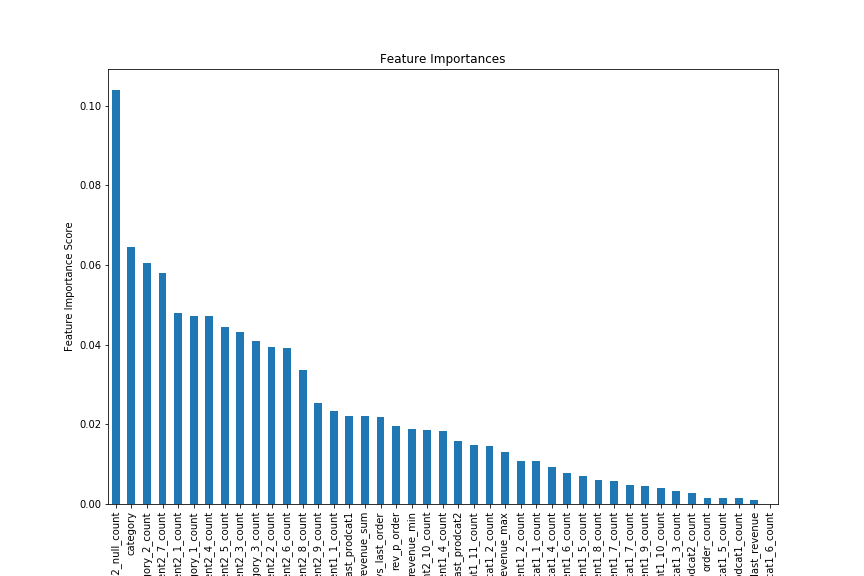
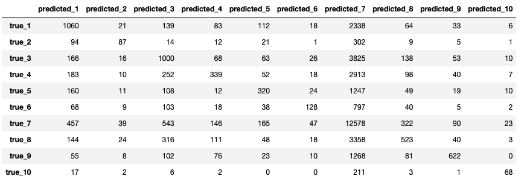
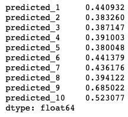
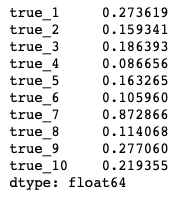

## Data Science Homework
__Objective__: Develop a predictive model based on the provided Order and Online customer behavior data (data.zip). The analysis can be done in R or Python and should be presented in an R-Studio Notebook or Jupyter Notebook. The assignment should produce a multi-class classification supervised learning model. It is up to you to design the analysis and provide a rationale of chosen approach. Feel free to use any open source tools or functions (out of the box or your own) that will facilitate the analysis. In your workflow, please touch on each of the following areas:							

1) Exploration and understanding of the data sets									
2) Feature engineering									
3) Feature selection									
4) Model design and sampling									
5) Model generation									
6) Model evaluation
7) Summary of results: 2-3 paragraphs textual summary
									
It is not necessary to produce a highly predictive model, but, rather, to illustrate your understanding and practical knowledge of the model building process. 									


### Data Sets

Table order.csv  263278 obs. of  6 variables:

|Columns|Data|Column Description|
|----|----|----|
|custno   | int  18944 18944 18944 36096 1 6401 25601 57601 2 2 ...		|Customer number		|
|ordno    | int  64694 28906 114405 62681 1 8187 41198 112311 70848 2 ...	|Order number			|
|orderdate| POSIXct, format: "2016-11-27 20:57:20" "2017-04-23 21:31:03"  	|Order date			|
|prodcat2 | int  NA NA NA NA NA NA NA NA NA NA ...				|Product category -detail	|
|prodcat1 | int  1 1 1 1 1 1 1 1 1 1 ...					|Product category		|
|revenue  | num  76.4 130.7 139.2 72.5 100.2 ...				|Revenue			|

	
Table: online.csv	954774 obs. of  7 variables:

|Columns|Data|Column Description|
|----|----|----|
|session| int  419542 3030130 2638740 880408 2612179 880953 418956 281663 26191 1363670 ...	|online session key|
|visitor| int  140970 14501 419353 90673 191542 419268 14938 419163 419163 14464 ...	|Online visitor key|
|dt| POSIXct, format: "2016-09-16 05:03:23"  ...	|Online activity date|
|custno| int  3840 70400 21248 39168 47616 47616 47872 49920 49920 54784 ...	|Customer number|
|category| int  1 1 1 1 1 1 1 1 1 1 ...	|Online browsing category|
|event1  | int  NA NA NA NA NA NA NA NA NA NA ...	|Online event 1|
|event2  | int  1 1 1 1 1 1 1 1 1 1 ...	|Online event 2|

___
#### 1. Exploratory Analysis
The [load_database.ipynb notebook](load_database.ipynb) import CSV files into MySQL database on my localhost. The [exploratory_analysis.ipynb notebook](exploratory_analysis.ipynb) explores the given dataset features prior to feature engineering. Summary statistics, charts and time series analysis are included in the notebook. The main patterns in the dataset include:
* Revenue is approximately uniformly distirbuted across purchase orders.
* Categorical variables (prodcat1, prodcat2, event1, event2) have highly unbalanced distirbution.
* From the __Order__ table, we learn that revenue and order counts (aggregated by day) follow regular seasonality pattern. The low point occurs in October and November, which is followed by the Christmas shopping spree season (from year 2015-12 to 2018-12).
* From the __Online__ table, we learn that online activity (aggregated by day) correlates with the revenue, and the three categories of activity follow suite. Furthermore, label 3~9 in event2 column follow the same seasonality pattern, where as label 1, 2, and 10 do not.
* In contrast, revenue per order do not exhibit seasonality pattern.
<p align="center">
    
</p>

___
#### 2. Feature Engineering
Feature engineering was performed in MySQL engine. The CSV files are loaded into MySQL database in the [load_database.ipynb notebook](load_dataset.ipynb). Indices are created on the *custno* columns. Because the goal is to predict __event2__ in the *Online* table, each row in the *Online* table gives a label, and our classifier must only use information earlier than a given row to make prediction. Four tables are generated using the following scripts, resulting in __50__ features. Among the 50 features, 7 features are categorical features. The categorical features are one-hot encoded.
```
mysql < feature_group_1.sql -uprivateuser -p
mysql < feature_group_2.sql -uprivateuser -p
mysql < feature_group_3.sql -uprivateuser -p
mysql < feature_group_4.sql -uprivateuser -p
```

[Group 1 (17 features)](features/feature_group_1.sql) features aggregates transaction data prior to an online event. For example, when user becomes active online (registering a row in the *Online* table), we ask the following questions: how much money has the user spent in the past, what is the biggest order and smallest order he ever placed, what is the revenue per order, and what are the product categories he purchased in the past? 

[Group 2 (24 features)](features/feature_group_2.sql) features join the *Online* table against itself. Among those samples features include the number of category 1, 2 and 3 event in the past, number of event 1 and event 2 in the past, and the number of missing values.

[Group 3 (3 features)](features/feature_group_3.sql) features ask about the latest record: what category, event1 and event2 were last recorded?

[Group 4 (3 features)](features/feature_group_4.sql) features ask about the latest transaction: how much did the user spend in the last order, and what product categories did he buy?

The full feature set is loaded in the feature_engineering [notebook](feature_engineering.ipynb). Most features follows exponential distribution, only revenue-per-order is normally distributed. For such observation, neural net and linear model that assume normal distribution will not work well.

The dataset is shuffled and split into 90% training set, 5% hold-out validation set (development set) and 5% test set. The original index of the three sets are stored in three separate tables. When loading a particular set, the index is simply joined with the feature tables. The dataset handling is implemented in the [helpers.py](helpers.py) module.

<p align="center">
    
</p>

___
#### 3. Features & Model Selection
Three candidate models are trained on a 100k training set and a 10k dev set. Among the three models, gradient boosting machine performs best, without tuning hyper-parameters. The 10-class accuracy score and feature importance ranking are summarized below. All features are included in the GBM model, because it is robust in high dimension.

|Model|Accuracy|Notebook|
|----|----|-------------|
|Baseline| 0.2585 ||
|Stochastic Gradient Descent | 0.2065 |[Link](sgd_basic.ipynb) |
|Random Forests | 0.2983 |[Link](random_forest_basic.ipynb) |
|Gradient Boosting Machine | 0.387 |[Link](gbm_basic.ipynb) |

<p align="center">
    
</p>

___
#### 4. Model Training & Evaluation
GBM takes a long time to train. The [GBM model](gbm_benchmark_2.ipynb) is trained on the original features in the CSV files only, and yields an accuracy score of 0.3905 on the full training set. The second bench mark is trained on the 43 numeric features, and boosts the accuracy to 0.4354. The confusion matrix shows 

When the one-hot encoding of categorical features are included, the dimension increases from 43 to __276__. The [basic version](gbm_benchmark_1.ipynb) of GBM, which is trained on 100k data points, shows that the inclusion of categorical features boosts 10-class accuracy from 0.3607 to 0.387. If the model is trained on the full dataset with categorical features, similar boost is expected.

However, the increase of dimension also slows down the training process. With 273 features, it takes over an hour to train the GBM on 100k data points on a CPU machine. If trained on the full 950k data points, training could take days. Due to the time constraint, no further hyperparameter tuning is attempted.

The confusion matrix shows that class 1 and class 7 are the dominant classes. Precision is well-balanced across 10 classes. Precisions for class 1 and 9 are particularly high. Where as recall exhibit greater variability. Class 9 and 10 have the highest recalls. The model is particularly good at predicting class 9.

<p align="center">
    
</p>

__10-class precision__
<p align="center">
    
</p>

__10-class recall__
<p align="center">
    
</p>

___
#### 5. Conclusion
The input tables are event logs. The information we can use to predict an event is limited to what is available prior to the event timestamp. For each row in the *Online*, we have a label *event2*, which takes on one of 10 classes. The classes are highly unbalanced, with class 7 dominating (38.5%).

Feature engineering was performed in MySQL engine, which offers the greatest degree of flexibility and efficiency. A total of 50 features are generated, 7 of which are categorical. After one-hot encoding, the feature diension is expanded to 273. Upon closer inspection, most features follow exponential distribution. The only exceptions are revenue-per-order (normal distribution) and last revenue (uniform distribution). Furthermore, strong seasonality pattern was observed. So it is necessary to generate a *month* feature, which has 12 cardinality, to capture the seasonality effect.

Three models were tried on a subsample of the dataset. Unsurprisingly, stochastic gradient descent classifier performed worst, since it relies on the assumption of normal distribution. Random forest barely beats the naive baseline. Gradient boosting machine performed the best. Without one-hot encoding of categorical features, GBM improving the 10-class accuracy from 0.385 to 0.4354. Where as precision is evenly distirbuted across 10 class (ranging between 0.4 and 0.6), recall is more skewed (between 0.08 and 0.87). Class 9 has the best precision (0.685). Class 7 has the best recall (0.872).

Ablative analysis shows that the newly engineered features are responsible for the improvement in accuracy from 0.385 to 0.4354. Further improvement is expected if categorical features are included. Unfortunately, this will take too long to train, given the time constraint of the assignment.
