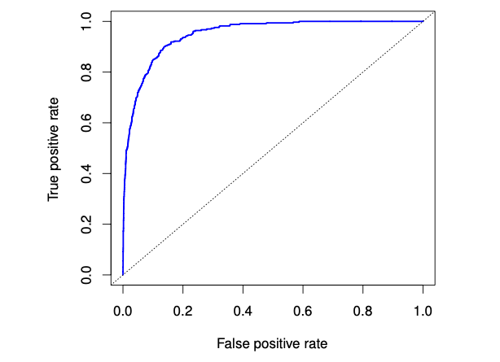

### Formula & Proof
| Name                      | Notebook |
|---------------------------|----------|
| Common distributions      | [Link](cheatsheet/distribution.pdf)
| Gaussian error function   | [Link](cheatsheet/gaussian_erf.pdf)
| Integrating Gaussian      | [Link](cheatsheet/integrate_Gaussian.pdf)
| Markov Inequality         | [Link](cheatsheet/markov_inequality.pdf)
| Statistical testing       | [Link](cheatsheet/statistical_test.pdf)

#### Metric
ROC Curve
* Right hand side: classify all as positive
  - Left side: classify all as negative
* AUC characterizes entire graph

