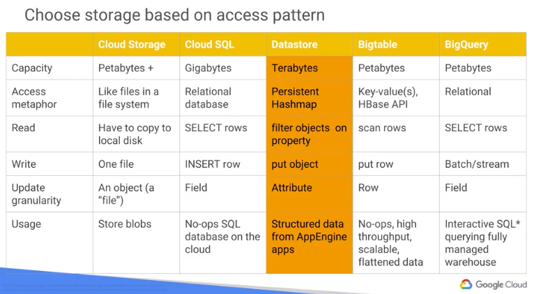

#### Storage - Always Encrypted at Rest

* Local SSD:
    - **Zonal**.
    - 375GB solid state drive physically attached to server.
    - Incredibly high performance.
    - Lost when instance shut down (can survive with `live migration`).
* Persistent Disk (PD): blocked-based network-attached storage.
    - **Regional**
    - ~ AWS Elastic Block Storage, or Storage Area Network of data center.
    - **Persist** even after shutting down.
    - Easy to resize during use.
    - Take snapshot (pay incremental time and $), use/delete like full backups.
    - block based, not file based: can mount to multiple instances if read-only.



* Cloud SQL:
    - **Regional**. gigabyte-scale.
    - On gigabyte-scale (small)
    - MySQL and PostgreSQL.
    - auto-replication, backup, failover.
    - Manual scaling, vertical and horizontal.
    - Advantage:
        - flexible pricing;
        - familiar (MySQL);
        - managed backups;
        - auto replication;
        - fast connection from GCE (Compute) & GAE (App);
        - connect from anywhere;
        - google security.
* Cloud Spanner:
    - **Regional, multi-regional, Global**.
    - ~ sharded MySQL, CockroachDB.
    - Used like a normal MySQL database though huge (thousands of nodes).
    - Recommend at least 3 nodes for each production environment.
    - **CAP Theorem**: choose two from `consistency`, availability, `partition-tolerance`.
    - Still 99.999% availability for multi-region.
    - **VERY EXPENSIVE**: for huge system only.
* BigQuery:
    - **Multi-regional**, petabyte-scale.
    - Server-less column-store data warehouse for analytics using MySQL. Accept **API** calls.
    - ~ AWS Redshift (AWS later released Athena, based on Presto).
    - Pay for data scanned during query. Results are cached for 24 hours if table is not changed.
    - Pay for data stored, and GB added via streaming inserts.
    - Warehousing well-structured data.
    - Ingest data:
        - file on disk or Cloud Storage
        - stream data (Dataflow)
        - Federated data source (CSV, JSON, AVRO, Google Sheet) on **server-less ETL**.
        - able to join data from sheet with other source!
* Cloud BigTable:
    - **Regional**, petabyte-scale.
    - Low latency, high-throughput NoSQL DB for large operational, analytical apps.
    - Wide column based. ~ AWS Dynamo DB, Cassandra, Apache HBase.
    - For huge workflow.
    - flattened, not hierarchical.
    - search by **key only** not property.
    - *High throughput write of wide-column data*.
    - cannot update property. Write entire row instead.
* Cloud DataStore:
    - **Regional, Multi-Regional**, terabyte-scale.
    - Managed, autoscaled NoSQL DB with indices, queries and ACID transaction support.
    - ~ Dybamo DB, MongoDB clusters.
    - no join or aggregates, must line-up indices.
    - Search by **properties**.
    - like a **persistent hashmap**.
    - Store objects directly (can search by ID or property).
    - Transaction support for hierarchical data (no integrity problem like relational DB).
* Database **Zonal**
* Cloud FireStore **Multi-Regional**
    - NoSQL document store with real-time client updates with managed web sockets.
    - FirebaseDB is single JSON doc.
    - Cloud FireStore has collections, documents, and contained data.
* Cloud Storage (GCS):
    - Regional, Multi-Regional
    - Infinitely scalable, fully-managed, versioned, highly durable object storage.
    - ~ AWS S3, Glacier.
    - create a bucket and copy the data over Cloud SDK.
    - blobs are referenced as ```gs://.../URL```.
    - Interact with Cloud Storage using Rest API.
    - not good for high throughput: real time read/write from sensor/compute node.
    - good for cache: read at later time, or imported into clusters for analysis.
* Data Transfer Appliance
    - ~ AWS Snowball
    - Ingest only.
* Storage Transfer Service [link](https://cloud.google.com/products/data-transfer/)
    - **Global**

#### Control Latency with Zones and Regions
* Zone = data center
* Choose closest **zone/region** to users, thus reducing latency.
* Distribute apps and data across **zones** to reduce service disruptions.
* Distribute your apps and data across **regions** for global availability.

#### Reference
* Cloud Datastore: https://cloud.google.com/datastore/
* Cloud Bigtable: https://cloud.google.com/bigtable/
* Google BigQuery: https://cloud.google.com/bigquery/
* Cloud Datalab: https://cloud.google.com/datalab/
