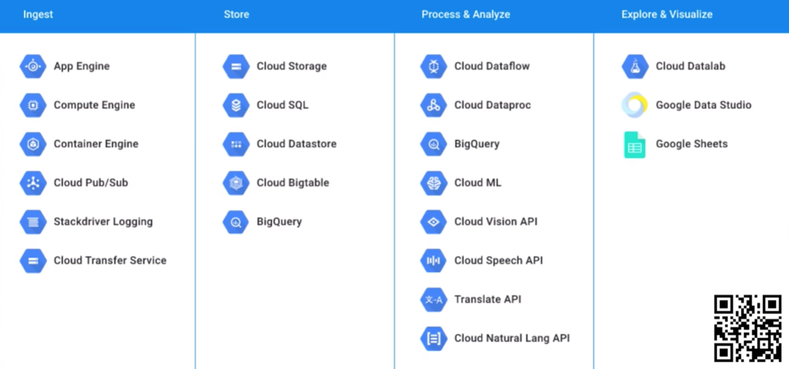
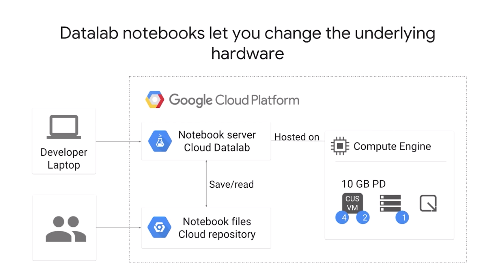

### Big Data
Open source systems:
1. Hadoop: http://hadoop.apache.org/
2. Pig: http://pig.apache.org/
3. Hive: http://hive.apache.org/
4. Spark: http://spark.apache.org/

#### Lifecycle
1. Ingest
2. Store
3. Process & Analyze
4. Explore & Visualize

___
### Ingest
#### IoT Core (Global)
* Fully managed service to connect, manage and ingest data from devices globally.
* ~ AWS IoT, or Custom Management.
* Publishes incoming telemetry to Cloud Pub/Sub for processing.
* CA signed certificates can be used to verify device ownership on first connect.

#### Cloud Pub/Sub (Global)
* Infinitely scalable at-least-once messaging for ingestion, decoupling, etc.
* Pull mode: ~ Amazon SNS (Simple Notification Service).
    - let clients set rate of consumption.
* Push mode: ~ Amazon SQS (Simple Queue Service), RabbitMQ, Amazon Kinesis, Apache Kafka.
    - delivers to HTTPS endpoints.
* Pay for data volume, not by message.

#### Cloud Dataprep (Global)
* visually explore, clean, prepare data for analysis **without** running servers.
* != AWS Glue
* Managed-version of `Trifacta Wrangler`, managed by Trafacta, not Google.
* Automatically detects schemas, datatypes, possible joins, outliers, missing values.

___
### Process
#### Cloud Dataproc (Zonal)
* Batch MapReduce processing via configurable, managed Spark & Hadoop clusters.
* ~ Amazon EMR, Spark, Hadoop.
* Google-managed: Hadoop, Pig, Hive, Spark!
* Pros:
    - `Image versioning` switches between different versions of Spark, Hadoop etc.
    - familiar.
    - resize in seconds (add/remove nodes).
    - automated cluster management.
    - integrates with Google Cloud (instead of HDFS).
        - Dataproc is job-specific; run for a short time.
        - storage and compute lifecycle is separated, with Google Cloud Storage.
    - flexible VMs (preemptible).
    - Google security.

#### Cloud Dataflow (Zonal)
* Smartly auto-scaled & fully managed batch or stream MapReduce-like processing.
* Better than `Cloud Dataproc`.
* ~ Amazon EMR, Spark, Hadoop, Apache Beam.
* Can re-shard data mid-job to optimize run-time.

___
### Explore
#### Cloud Datalab (Regional)
* Interactive tool: Juypyter Notebooks.
* Pay for instances hosting notebooks.
* Can store on Git or Cloud Repository.
* Computation is done on Compute Engine.
* If GCloud is installed on local computer, can run Datalab locally!

#### Cloud Data Studio (Global)
* Big data visualization tool for dashboard and reporting.
* ~ Tableu.
* Time series, pie chart, bar chart, heat maps. geo-maps, score-cards, scatter etc.

#### Cloud Genomics (Global)
* Genomic information processing for large research projects.
* "Resister pay" cost sharing.
