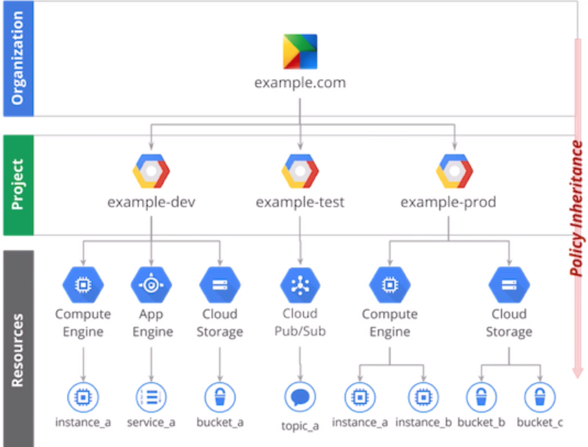
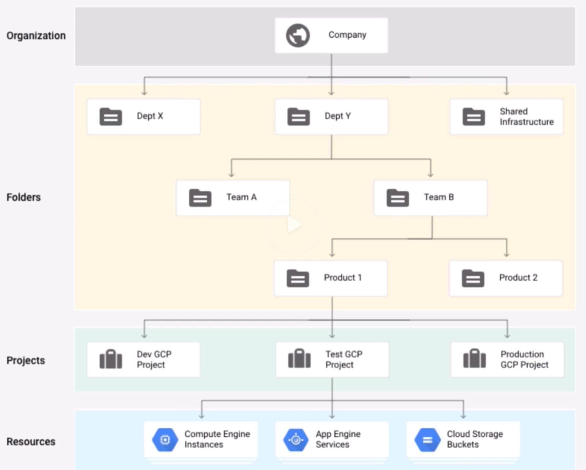

### Identity & Security
* Roles are collections of Permissions to use or manage GCP resources.
* Nomenclature: `service.resource.verb`, e.g. compute.insances.start.
* Primitive roles (too board, good for dev-test env only):
    - Viewers: read-only.
    - Editors: can change things.
    - Owners: can control access & billing.
* Predefined roles: give granular access to specific GCP resources.
    - e.g. roles/bigquery.dataEditor.roles
* Custom roles: project, org-level collections defined for granular permissions.

#### Cloud IAM (Global)
* Authorization, not authentication/identity.
* Member: user, group, domain, service account, or public ("allUsers")
    - individual Google account, Google group, G Suite
    - Service account.
* Policies bind members to roles at a hierarchy level: org, folder, project, resource:
    - "Who can do what to which things."
* IAM is free.

#### Service Account (Global)
* Represents an application, not an end user.
* Can be "assumed" by applications or individual users.
* Recommendation: use service account, not user account or API keys.
* Use *principle of least privilege*.

#### Cloud Identity (Global)
* Identity as a Service (IDaaS, not DaaS).
* Free to use.

#### Security Key Enforcement (Global)
* USB or Bluetooth 2-step verification device that prevents phishing.

#### Resource Manager (Global)
* Centrally manage & secure organization's projects with custom folder hierarchy.
* ~ AWS Organization.
* Can apply policies at organization, folders, projects levels.

#### Cloud Audit Logging (Global)
* "who did what, where and when" within GCP projects.
* Two audit logs for each project and organization (admin, data access).
* ~ AWS Cloud Trail
* Stackdriver family service.

#### Cloud Key Management Service (KMS, regional, global)
* Move secrets out of code into environment securely.
* Integrated with IAM & Cloud Audit Logging to authorize & track key usage.
* Rotate keys on demand or automatically.
* Key deletion has 24 hours delay.

#### Cloud IAP (Identity-aware Proxy, global)
* Guard apps running on GCP through identity verification instead of VPN access.
* ~ Amazon API Gateway.
* Pay for load-balancing forwarding rules and traffic.

#### Security Scanner (Global)
* Free, limited GAW app vulnerability scanner with low false positive rate.
* ~ Amazon Inspector
* Crawls application and follow all links.
* Identify cross site scripting (XSS), flash injection, mixed content, outdated/insecure libraries.

#### Cloud Data Loss Prevention API (DLP, Global)
* Finds and **redacts** sensitive info in unstructured data streams.
* ~ Amazon Macie.
* detects 50+ sensitive data categories on text/images (SSN, Passport).
* Pay by GB of volume processed.
