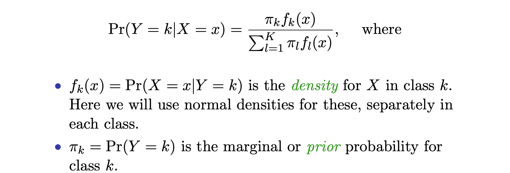
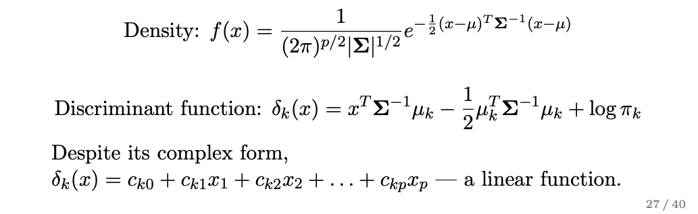
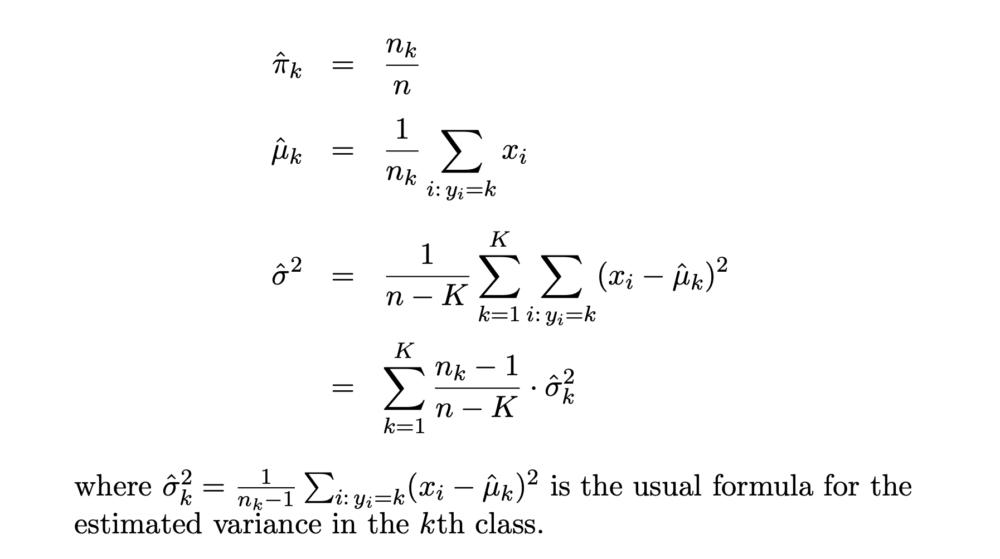
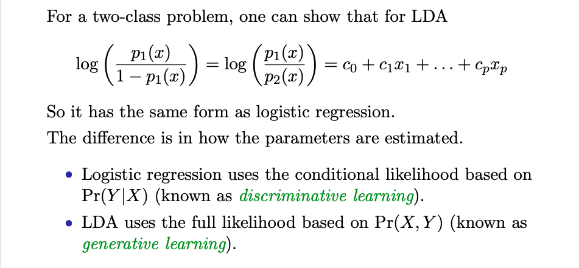

#### Bayes Rule

* Gaussian density has the following discriminant score. After taking log of likelihood, and removing terms that does not depend on `k`
* The boundary is linear in terms of `x`

#### For Multivariate Gaussian

#### Estimating Parameters

#### Recover Probability

#### Takeaway
* If population model is right, then the Bayes rule is the best we can do.
* When data are separable, model doesn't blow up like logistic regression.
* More stable than logistic regression when dataset is small
* When gaussian density has different variance in each class, lead to **quadratic discriminant analysis**
* Conditional independence among features leads to **naive bayes**. For Gaussian naive bayes, covariance is diagonal.
  - when p is large, multivariate methods like QDA and even LDA break down

#### Comparison to Logistic Regression

