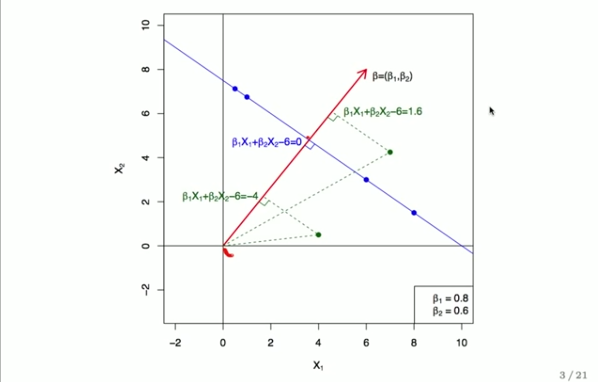

### Support Vector Machine
* Treat all parameters equally
  - need to **standardize variables**
* f(X) = b0 + b1 * x1 + b2 * x2 + ...
* f(X) defines a hyperplane
* Vector (b1, b2 ...) is perpendicular to the hyperplane

* All points on the hyper plane has distance zero to the hyperplane (trivial)
  - Plug any point into f(X), the result is **distance** from the hyperplane

**Formulation**
- In optimization formulation, Vector (b1, b2 ...) is constrained to have norm 1.
- Multiply y guarantees that each observation will be on the correct side of the hyper- plane, provided that M is positive
- M is the margin

#### Soft Margin
Motivation for soft margin:
* Non Separable Dataset
  - When data points is fewer than dimension, can always separate.
* Noisy data leads to crazy overfitting (outlier can have dramatic effect).
* `C` is the total budget for slack
  - Large C means more tolerance

#### Kernel
* Feature expansion: include polynomial terms
  - fit SVM in expanded space, results in non-linear decision in original space
  - dimension explodes very fast, better to use kernel 
