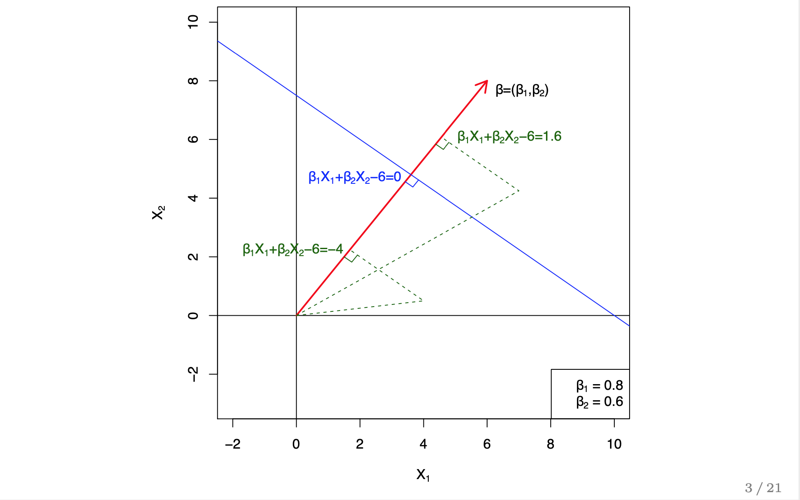
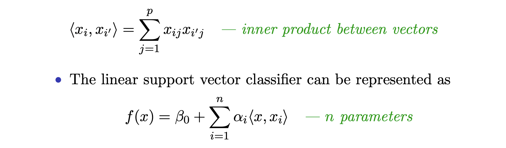
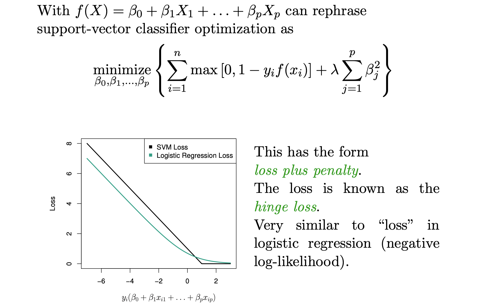

### Support Vector Machine
* Treat all parameters equally
  - need to **standardize variables**
* f(X) = b0 + b1 * x1 + b2 * x2 + ...
* f(X) defines a hyperplane
* Vector (b1, b2 ...) is perpendicular to the hyperplane

* All points on the hyper plane has distance zero to the hyperplane (trivial)
  - Plug any point into f(X), the result is **distance** from the hyperplane

**Formulation**
- In optimization formulation, Vector (b1, b2 ...) is constrained to have norm 1.
- Multiply y guarantees that each observation will be on the correct side of the hyper- plane, provided that M is positive
- M is the margin

#### Soft Margin
Motivation for soft margin:
* Non Separable Dataset
  - When data points is fewer than dimension, can always separate.
* Noisy data leads to crazy overfitting (outlier can have dramatic effect).
* `C` is the total budget for slack
  - Large C means more tolerance

#### Kernel
* Feature expansion: include polynomial terms
  - fit SVM in expanded space, results in non-linear decision in original space
  - dimension explodes very fast, better to use kernel
SVM classifier can be expressed in a linear combination of **inner products**, plus a bias.
  - We need **N choose 2** inner products, instead of the original dataset.
  - Most inner products have zero coefficients. Those with non-zero coefficients are **support vectors**.
  - *Sparsity in data space, not feature space. Assigning a weight to each data point.*
  - Doesn't mean can throw away most points, because they are needed to find support points.
  - a **kernel** function takes two data points, and compute inner product in higher dimension space.

> If we can compute the inner products among all data points, and between all training points and test points, we can fit SVM on the inner products.

#### Multi-class SVM
* OVA: one versus all, fit K classifier
* OVO: fit (K choose 2) classifier

#### Comparison to Logistic Regression

* Recall logistic loss: `- y log (y_hat) + (1 - y) log (1 - y_hat) `
* Pro:
  - Better then data are separable. LR (without regularization) breaks down
* Con:
  - SVM high dimension does not do feature selection. Use all features. Can't interpret.
  - Doesn't yield probability.
